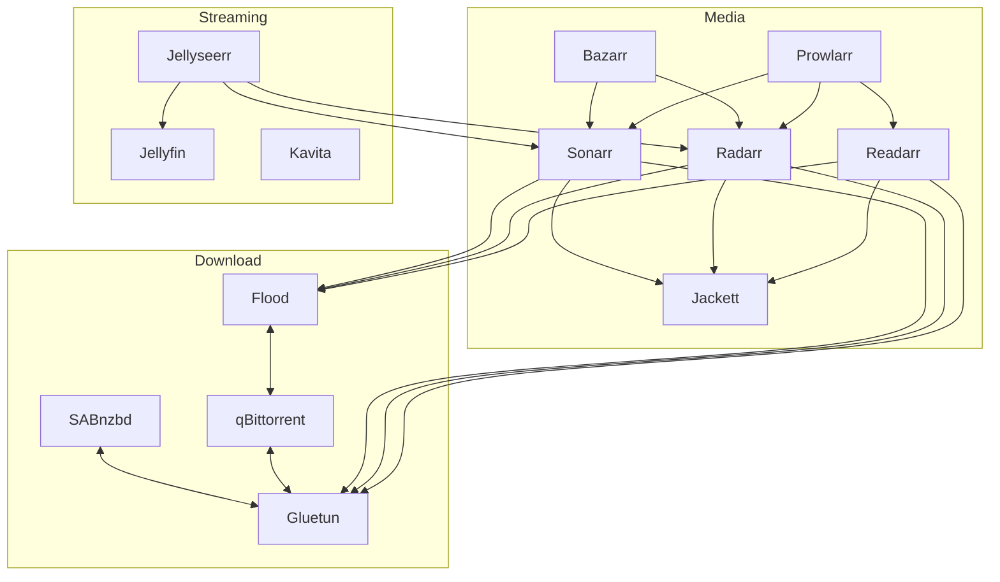

# HatSetup

This Repo displays and descibes my Setup of the Prirate-Hat Services.
I have currently deployed the following services via Docker-Compose:

Media Management:
- [Sonarr](media/sonarr.md) is a Services for Managing Series. Managing the local files, Series Naming via Series Database and Grabbing new Series from the Internet.
- [Radarr](media/radarr.md) is a Services for Managing Movies. Managing the local files, Movies Naming via Movies Database and Grabbing new Movies from the Internet.
- [Readarr](media/readarr.md) is a Services for Managing Books/Comics. Managing the local files, Book Naming via Book Database and Grabbing new Books from the Internet.
- [Bazarr](media/bazarr.md) is a Services for Managing Subtitles. It scans the local files (including the Vidoes embeded ones) and grabs missing Subtitles from the Internet.
- [Jackett](media/jackett.md) is a Torrent Convertion Service. It access many Torrent Providers and translate the API/Data into something Sonarr/Radarr/Readarr/Lidarr/... compatible.
- [Prowlarr](media/prowlarr.md) is a indexer Manager/Proxy. It's a central management to syncronize Sonarr/Radarr/Readarr/Lidarr/...

Download Management:
- [Gluetun](download/gluetun.md) is VPN-Client and Proxy for Docker. All traffic is routed trough it and ports are forwarded from the Services.
- [Sabnzbd](download/sabnzbd.md) is a Usenet Download Manager. It access the NewsProvider to download the "Articles" requested by the Indexer.
- [Qbittorrent](download/qbittorrent.md#qbittorrent) is a Torrent Download Manager. It access available Torrent-Seeders to download the "Torrents" requested by the Indexer.
- [Flood](download/qbittorrent.md#flood) is a Web-UI for multiple Torrent Clients, originally named Flood-UI.

Streaming Services:
- [Jellyfin](streaming/jellyfin.md) is a Media Streaming Server. It access the local Media Files and streams them to the Clients.
- [Jellyseer](streaming/jellyseer.md) is a Bridge between Jellyfin and Sonarr & Radarr. Users can request Series/Movies via the Jellyfin Login that will then added to Sonarr/Radarr.
- [Kavita](streaming/kavita.md) is a Book/Comic Streaming Server. It access the local Media Files and streams them to the Clients.

---

