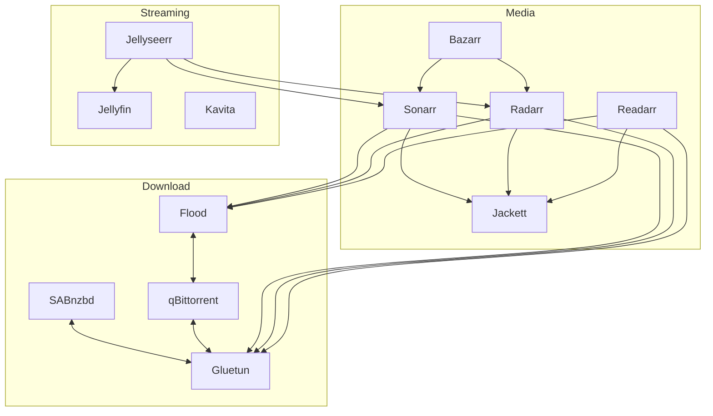

# HatSetup

This Repo displays and descibes my Setup of the Prirate-Hat Services.
I have currently deployed the following services via Docker-Compose:

Media Management:
- [Sonarr](media/sonarr.md)
- [Radarr](media/radarr.md)
- [Readarr](media/readarr.md)
- [Bazarr](media/bazarr.md)
- [Jackett](media/jackett.md)

Download Management:
- [Gluetun](download/gluetun.md)
- [Sabnzbd](download/sabnzbd.md)
- [Qbittorrent](download/qbittorrent.md#qbittorrent)
- [Flood](download/qbittorrent.md#flood)

Streaming Services:
- [Jellyfin](streaming/jellyfin.md)
- [Jellyseer](streaming/jellyseer.md)
- [Kavita](streaming/kavita.md)

